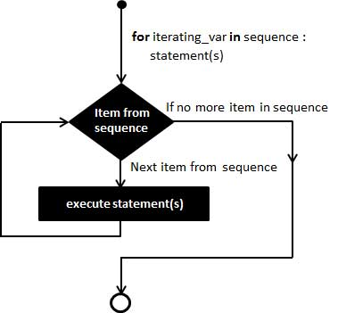

>a day is a miniature of eternity.   (Emerson)

# 程序结构
* 顺序结构
* 分支结构
* 循环结构

## 顺序结构
> 默认结构，程序语句从上而下，按行逐一执行

## 分支结构
* 单分支
* 双分支
* 多分支
* 分支结构永远只有1个或0个分支会被执行
* 判断条件只能是Bool类型或可以隐式转化为Bool类型

### 单分支
>程序开始  
if 条件表达式:  
　　操作  
结束  
 　　
```
In [2]: a = 520

In [3]: if a == 520:    # a满足，进入if分支，输出结果
   ...:     print("Yes,{}".format(a))
   ...:     
Yes,520

In [4]: if a != 520:    # a不满足，不进入If分支，无输出
   ...:     print("Yes,{}".format(a))
   ...:     

```
### 双分支

>开始
if 条件：  
　　操作1  
else:  
　　操作2  
结束  

```
In [6]: if a < 123:   # a = 520，不满足，不执行 
   ...:     print("a is {}, a is less than 123.".format(a))
   ...: else:         # 满足条件，执行
   ...:     print("a is {}, a is bigger than 123.".format(a))
   ...:     
a is 520, a is bigger than 123.
```
**通过结构嵌套实现的多分支，并不建议使用**  

### 多分支

>程序开始  
if 条件1:  
　　操作1  
elif 条件2:  
　　操作2  
...  
elif 条件N:  
　　操作N  
else:  
　　操作退出  
结束   

```
In [8]: if a < 123:
   ...:     print("a is {}, a is less than 123.".format(a))
   ...: elif 123< a < 550 :
   ...:     print("a is {}, a is less than 500 and bigger than 123.".format(a))
   ...: else:
   ...:     print("a is {}, a is bigger than 550.".format(a))
   ...:     
a is 520, a is less than 500 and bigger than 123.
```

## 循环结构
* while循环
* for in循环  

### while循环
 

```
In [9]: i = 0

In [10]: while i < 5:   
    ...:     print(i)
    ...:     i += 1    # 修改循环机制，达到退出循环条件
    ...:     
0
1
2
3
4
```    
>当while条件为True时，可实现死循环

### for in 循环


```
In [11]: for i in range(5):      # 给定循环次数，退出循环
    ...:     print(i)
    ...:     
0
1
2
3
4
```
>for in 循环中修改可迭代对象，可能造成结果不可预料  
>while循环中可以嵌入for循环， 也可以在for循环中嵌入while循环

## break and continue
### break：提前终止循环，退出，但只能退出当前循环，退出多层循环需要根据While条件进行修改
```
In [12]: for i in range(0,10):
    ...:     if i % 2 !=0:
    ...:         print(i)
    ...:         break        #退出循环，不再执行
    ...:     
1
```
### continue：用于跳过循环体剩下的部分
```
In [13]: for i in range(0,10):
    ...:     if i % 2 !=0:
    ...:         print(i)
    ...:         continue    # 跳过下条语句，重新进入循环
    ...:         print(i+1)
    ...:             
1
3
5
7
9
```
## else子句
> python中除了if，while及for循环都支持else子句，用于当循环没有提前退出时，执行  

```
In [15]: for i in range(0,10):
    ...:     if i % 2 !=0:
    ...:         print(i)
    ...:         continue    # 没有提前退出for，执行else子句
    ...: else:
    ...:     print('ok')
    ...:        
1
3
5
7
9
ok

In [16]: for i in range(0,10):
    ...:     if i % 2 !=0:
    ...:         print(i)
    ...:         break     # 退出循环条件，不执行else
    ...: else:
    ...:     print('ok')
    ...:        
1
```

